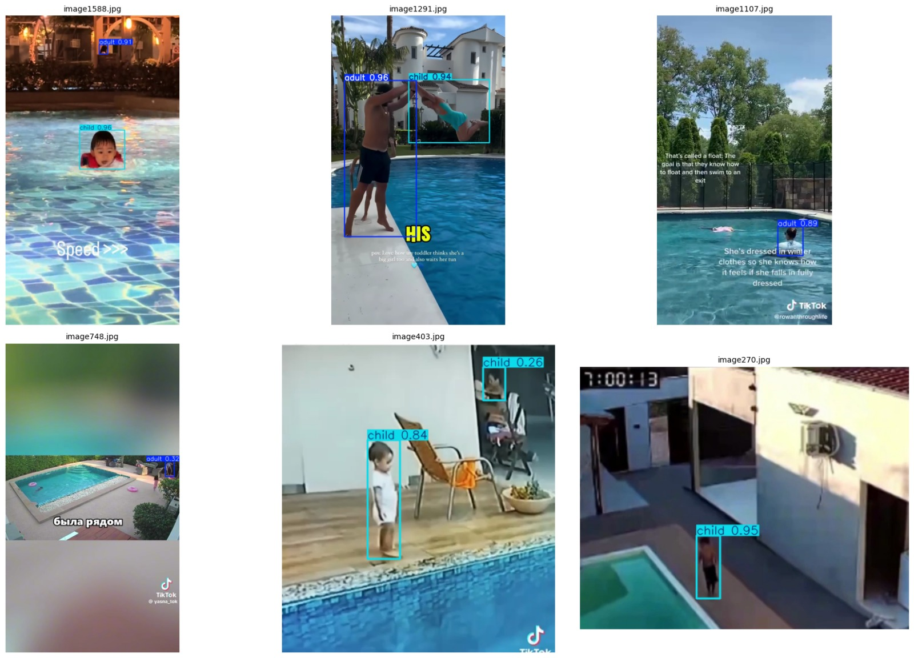
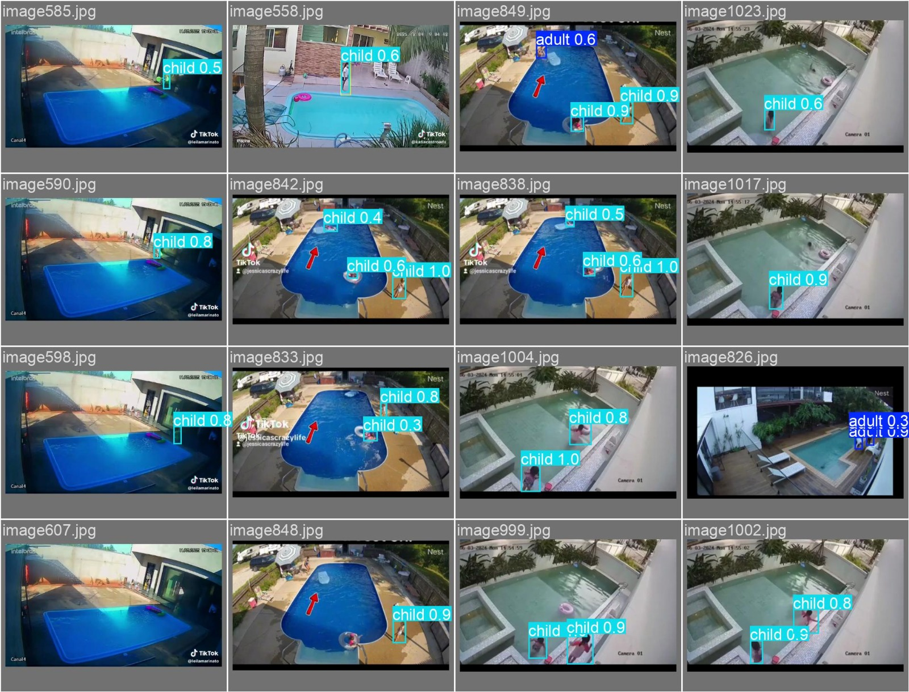
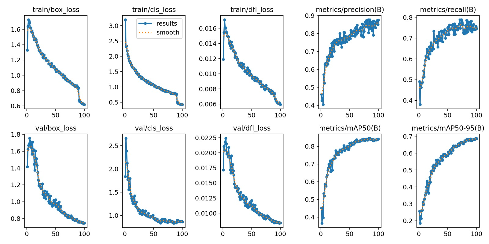

# YOLO Pool - Swimming Pool Safety System

[](https://www.python.org/downloads/)
[](LICENSE)
[](https://docs.ultralytics.com/)
[](https://github.com/ultralytics/ultralytics)
[](https://pytorch.org/)

Real-time swimming pool safety monitoring system that detects **adults and children** around swimming pools using a custom-trained **YOLOv8m** model with **ByteTrack** multi-person tracking.

---

## Table of Contents

- [Architecture](#architecture)
- [Detection Examples](#detection-examples)
- [Features](#features)
- [Dataset](#dataset)
- [Training](#training)
- [Training Results](#training-results)
- [Installation](#installation)
- [Usage](#usage)
- [Tools](#tools)
- [Project Structure](#project-structure)
- [Model Details](#model-details)
- [Edge Deployment (Jetson Nano)](#edge-deployment-jetson-nano)
  - [Adim 1: JetPack Kurulumu](#adim-1-jetpack-kurulumu-sd-kart-hazirlama)
  - [Adim 2: Projeyi Kopyalama](#adim-2-projeyi-jetsona-kopyalama)
  - [Adim 3: Otomatik Kurulum](#adim-3-otomatik-kurulum)
  - [Adim 4: Model Export](#adim-4-model-export-pytorch---tensorrt)
  - [Adim 5: Sistemi Calistirma](#adim-5-sistemi-calistirma)
  - [Sorun Giderme](#sorun-giderme)
- [Python API](#python-api)
- [License](#license)

---

## Architecture

The system uses a **YOLOv8m detection pipeline** for real-time adult/child classification:

```
Video Frame
    │
    └──► Custom YOLOv8m ──► Adult/Child Detection ──► ByteTrack Tracking
          (best_pool_adult_child.pt)                      │
                                                          │
                                                   Per-Person Data
                                                   (bbox + class + track_id)
                                                          │
                                                   Annotated Frame
                                                   (bounding boxes + labels)
```

### How It Works

1. **Detection Model (YOLOv8m):** Custom-trained on 14K+ pool images to classify persons as `adult` or `child`. Uses **ByteTrack** for multi-person tracking across frames, assigning persistent IDs.

2. **Tracking:** Each detected person gets a unique ID that persists across frames, enabling consistent labeling and counting.

3. **Annotation:** Bounding boxes are drawn with color-coded labels (cyan for adults, orange for children) along with confidence scores and track IDs.

---

## Detection Examples

<p align="center">
  
</p>

<p align="center">
  
</p>

---

## Features

| Feature | Description |
|---------|-------------|
| **YOLOv8m Detection** | Custom-trained model for adult/child classification around swimming pools |
| **Multi-Person Tracking** | ByteTrack-based tracking with persistent IDs across frames |
| **Real-time Webcam** | Live detection with FPS display, adjustable confidence threshold, and screenshot capture |
| **Video/Image Processing** | Batch processing for video files, images, and RTSP streams with H.264 output |
| **Child-Alone Warning** | Dedicated tool for detecting children without adult supervision |
| **Edge Deployment** | Optimized for NVIDIA Jetson Nano with TensorRT export support |

---

## Dataset

### Overview

The model was trained on a **custom dataset of 14,114 labeled instances** across **3,374 images** of swimming pool environments.

| Property | Value |
|----------|-------|
| **Total Images** | 24k |
| **Total Instances** | 14,114 |
| **Adult Instances** | 6,975 (across 2,385 images) |
| **Child Instances** | 7,139 (across 2,532 images) |
| **Classes** | 2 (`adult`, `child`) |
| **Label Format** | YOLO (normalized: `class_id x_center y_center width height`) |
| **Image Resolution** | Various (resized to 640×640 during training) |

### Data Sources

- **Custom labeled pool images** — Manually labeled using [CVAT](https://www.cvat.ai/) and [Roboflow](https://roboflow.com/)
- **Roboflow Universe** — [Child v Adult Dataset](https://universe.roboflow.com/testing-vno6g/child-v-adult/) on Roboflow Universe

### Data Split

| Split | Ratio | Purpose |
|-------|-------|---------|
| **Train** | 80% | Model training with augmentation |
| **Validation** | 15% | Hyperparameter tuning and early stopping |
| **Test** | 5% | Final evaluation |

### Dataset Configuration (`configs/data.yaml`)

```yaml
train: dataset/images/train
val: dataset/images/val
test: dataset/images/test

nc: 2
names: ['adult', 'child']
```

### Local Dataset

The `dataset/` directory contains 2,540 labeled pool images for local development:

```
dataset/
├── images/   # 2,540 JPEG images (~470 MB)
└── labels/   # 2,540 YOLO format labels (~8.5 MB)
```

---

## Training

### Environment

| Component | Specification |
|-----------|--------------|
| **Platform** | Google Colab |
| **GPU** | NVIDIA A100-SXM4-40GB (40 GB VRAM) |
| **CUDA** | cu128 |
| **Python** | 3.12.12 |
| **PyTorch** | 2.9.0+cu128 |
| **Ultralytics** | 8.3.50 |

### Training Configuration

| Hyperparameter | Value |
|----------------|-------|
| **Base Model** | `yolov8m.pt` (YOLOv8-medium) |
| **Image Size** | 640×640 |
| **Batch Size** | 16 |
| **Max Epochs** | 100 |
| **Patience** | 20 (EarlyStopping) |
| **Optimizer** | Auto (AdamW) |

### Data Augmentation

| Augmentation | Value |
|-------------|-------|
| `hsv_h` | 0.015 |
| `hsv_s` | 0.7 |
| `hsv_v` | 0.4 |
| `degrees` | 10.0 |
| `translate` | 0.1 |
| `scale` | 0.5 |
| `fliplr` | 0.5 |
| `mosaic` | 1.0 |
| `mixup` | 0.1 |

### Training Process

- Training stopped early at **epoch 78** (via EarlyStopping, patience=20)
- Best results observed at **epoch 58**
- Total training time: **2.569 hours**
- Model size: **52.0 MB** (before optimizer stripping)
- Model architecture: **218 layers, 25,840,918 parameters, 0 gradients, 78.7 GFLOPs**

### Google Colab Notebook

The full training pipeline is available at `notebooks/train_colab.ipynb`:

1. Mount Google Drive and extract dataset
2. Analyze class distribution
3. Split into train/val/test (80/15/5)
4. Train YOLOv8m for 100 epochs with augmentation
5. Evaluate and save best model to Drive

---

## Training Results

<p align="center">
  
</p>

<p align="center">
  
</p>

### Validation Metrics

| Class | Images | Instances | Box(P) | Recall | mAP50 | mAP50-95 |
|-------|--------|-----------|--------|--------|-------|----------|
| **all** | 3,374 | 14,114 | 0.835 | 0.808 | 0.86 | 0.552 |
| **adult** | 2,385 | 6,975 | 0.833 | 0.829 | 0.868 | 0.563 |
| **child** | 2,532 | 7,139 | 0.836 | 0.786 | 0.852 | 0.541 |

### Inference Speed (A100)

| Stage | Time |
|-------|------|
| Preprocess | 0.1 ms |
| Inference | 1.0 ms |
| Loss | 0.0 ms |
| Postprocess | 0.8 ms |
| **Total** | **~2.0 ms per image** |

---

## Installation

### Requirements

- Python 3.8+
- CUDA-compatible GPU (recommended for real-time inference)

### Setup

```bash
git clone https://github.com/mftnakrsu/yolo_pool.git
cd yolo_pool
pip install -r requirements.txt
```

### Development Install

```bash
pip install -e .
```

### Dependencies

| Package | Version | Purpose |
|---------|---------|---------|
| `ultralytics` | 8.3.40 | YOLO model framework |
| `opencv-python` | 4.10.0.84 | Image/video I/O and processing |
| `torch` | 2.5.1 | PyTorch deep learning backend |
| `torchvision` | 0.20.1 | Vision utilities |
| `numpy` | 1.26.4 | Numerical operations |
| `Pillow` | 11.0.0 | Image handling |

---

## Usage

### Video Processing

```bash
# Basic
python detect.py -i video.mp4 -o output.mp4

# With specific model and confidence
python detect.py -i video.mp4 -o output.mp4 \
    --model best_pool_adult_child.pt \
    --conf 0.25

# Headless (no preview window)
python detect.py -i video.mp4 -o output.mp4 --no-preview
```

### Image Processing

```bash
python detect.py -i photo.jpg -o result.jpg
```

### Webcam (Real-time)

```bash
# Basic webcam
python detect.py --webcam

# Advanced real-time with FPS display, confidence control, and screenshot
python realtime.py

# Custom settings
python realtime.py --model best_pool_adult_child.pt --conf 0.4 --camera 0
```

**Real-time Keyboard Controls:**

| Key | Action |
|-----|--------|
| `q` | Quit |
| `s` | Save screenshot |
| `+` / `-` | Adjust confidence threshold (±0.05) |

### IP Camera (RTSP)

```bash
python detect.py -i "rtsp://user:pass@ip:port/stream"
```

### CLI Parameters

| Parameter | Description | Default |
|-----------|-------------|---------|
| `-i, --input` | Input video/image/RTSP path | - |
| `-o, --output` | Output file path | - |
| `-m, --model` | Custom detection model | `best_pool_adult_child.pt` |
| `-c, --conf` | Confidence threshold (0-1) | `0.25` |
| `-w, --webcam` | Use webcam | `False` |
| `--no-preview` | Disable live preview window | `False` |
| `--camera` | Camera index (realtime.py) | `0` |
| `--width` | Frame width (realtime.py) | `1280` |
| `--height` | Frame height (realtime.py) | `720` |

---

## Tools

Utility scripts in `tools/` for dataset preparation and video processing:

### Auto-Label Images

Automatically detect and label persons in images using a YOLO model:

```bash
python tools/auto_label.py --source frames/ --output dataset/ --model yolov8m.pt
```

### Extract Frames from Videos

Extract frames from video files at regular intervals:

```bash
python tools/extract_frames.py --input videos/ --output frames/ --interval 30
```

### Batch Process Videos

Process multiple videos with stylish bounding boxes:

```bash
python tools/batch_process.py --input videos/ --output processed/
```

### Child-Alone Warning Detection

Detect situations where children are near the pool without adult supervision:

```bash
python tools/process_child_adult.py --input video.mp4
```

### Split Videos

Split long videos into fixed-duration segments:

```bash
python tools/split_videos.py --input video.mp4 --duration 6
```

---

## Project Structure

```
yolo_pool/
├── detect.py                       # Main CLI: video/image/webcam detection
├── realtime.py                     # Real-time webcam with FPS and controls
├── best_pool_adult_child.pt        # Custom trained YOLOv8m model (46 MB)
│
├── yolo_pool/                      # Core Python package
│   ├── __init__.py                 # Exports PoolPersonDetector
│   ├── detector.py                 # PoolPersonDetector class (detection orchestrator)
│   ├── visualization.py            # Drawing functions (bbox, status)
│   └── utils.py                    # Helpers (IoU, video capture, video writer)
│
├── tools/                          # Utility scripts (all argparse-based)
│   ├── auto_label.py               # Auto-label images with YOLO
│   ├── extract_frames.py           # Extract frames from videos
│   ├── batch_process.py            # Batch video processing
│   ├── process_child_adult.py      # Child-alone warning detection
│   └── split_videos.py             # Split videos into segments
│
├── notebooks/
│   └── train_colab.ipynb           # Google Colab training pipeline
│
├── configs/
│   └── data.yaml                   # Dataset configuration template
│
├── dataset/                        # Local training dataset (gitignored)
│   ├── images/                     # 2,540 JPEG images (~470 MB)
│   └── labels/                     # 2,540 YOLO format labels (~8.5 MB)
│
├── jetson/                         # Jetson Nano deployment scripts
│   ├── install.sh                  # Full installation script
│   ├── export_models.sh            # .pt to .engine TensorRT export
│   ├── run.sh                      # Launch script with camera detection
│   └── requirements_jetson.txt     # Jetson-specific Python dependencies
│
├── docs/
│   ├── architecture.md             # Architecture details
│   ├── detection_examples.jpeg     # Detection example images
│   ├── detection_grid.jpeg         # Detection results grid
│   ├── training_results.jpeg       # Training curves and metrics
│   └── training_validation_results.png  # Validation results screenshot
│
├── requirements.txt                # Pinned Python dependencies
├── LICENSE                         # MIT License
├── CLAUDE.md                       # Claude Code instructions
└── README.md                       # This file
```

---

## Model Details

### Custom Detection Model (`best_pool_adult_child.pt`)

| Property | Value |
|----------|-------|
| **Architecture** | YOLOv8-medium |
| **Task** | Object Detection |
| **Classes** | 2 (`adult`, `child`) |
| **Input Size** | 640×640 |
| **Layers** | 218 |
| **Parameters** | 25,840,918 |
| **GFLOPs** | 78.7 |
| **File Size** | ~46 MB |
| **mAP50** | 0.86 |
| **mAP50-95** | 0.552 |

### Model Selection Guide

| Model | Size | mAP50 | Speed | Use Case |
|-------|------|-------|-------|----------|
| `best_pool_adult_child.pt` | 46 MB | 0.86 | ~2 ms (A100) | Production: adult/child detection |
| `best_pool_adult_child.engine` | ~50 MB | 0.86 | Optimized | Jetson Nano (TensorRT) |
| `yolov8m.pt` | 44 MB | - | ~2 ms | Base detection (pre-trained) |

### Visualization Colors (BGR)

| Element | Color | BGR Value |
|---------|-------|-----------|
| Adult bbox | Cyan | (0, 200, 255) |
| Child bbox | Orange | (255, 147, 0) |

---

## Edge Deployment (Jetson Nano)

Bu proje **NVIDIA Jetson Nano** uzerinde calisacak sekilde optimize edilmistir. Asagida [OpenZeka J202 Carrier Board](https://openzeka.com/urun/j202-nvidia-jetson-nano-hazir-yapay-zeka-kiti/) icin sifirdan kurulum anlatilmaktadir.

### J202 Carrier Board Ozellikleri

| Ozellik | Detay |
|---------|-------|
| **Modul** | NVIDIA Jetson Nano (4GB) |
| **GPU** | 128 cekirdek NVIDIA Maxwell |
| **CPU** | 4 cekirdek ARM Cortex-A57 @ 1.43 GHz |
| **RAM** | 4 GB 64-bit LPDDR4 |
| **Depolama** | microSD + M.2 Key M (NVMe SSD) |
| **USB** | 4x USB 3.2 Gen 2 |
| **Ag** | Gigabit Ethernet |
| **Kablosuz** | M.2 Key E (WiFi/BT modulu) |
| **Kamera** | 2x MIPI CSI-2 (IMX219, IMX477 uyumlu) |
| **GPIO** | 40 pin Raspberry Pi uyumlu header |
| **AI Performansi** | 472 GFLOPS (FP16) |
| **Guc** | 5W / 10W modlari |
| **Dagitici** | [OpenZeka (NVIDIA Embedded Distributor)](https://openzeka.com/) |

---

### Adim 1: JetPack Kurulumu (SD Kart Hazirlama)

Jetson Nano'yu kullanmak icin once isletim sistemini SD karta yazmaniz gerekir. Bunun icin baska bir bilgisayar (Windows/Mac/Linux) kullanacaksiniz.

1. **SD kart hazirlayin:** En az 32 GB, Class 10 veya UHS-1 microSD kart
2. **JetPack indirin:** [NVIDIA JetPack SDK](https://developer.nvidia.com/embedded/jetpack) sayfasindan **JetPack 4.6.x** imajini indirin
3. **SD karta yazin:**
   - Windows: [balenaEtcher](https://www.balena.io/etcher/) indirin, imaji secin, SD karti secin, "Flash" tusuna basin
   - Mac: Ayni sekilde balenaEtcher kullanin
4. **SD karti Jetson'a takin** ve guc kablosunu baglayin
5. **Ilk acilista** ekrandaki adimlari izleyerek kullanici adi, sifre ve WiFi ayarlayin

> **NOT:** JetPack ile birlikte CUDA, cuDNN ve TensorRT otomatik olarak kurulur. Bunlari ayrica kurmaniza gerek yoktur.

---

### Adim 2: Projeyi Jetson'a Kopyalama

Jetson'da terminal acin (Ctrl+Alt+T) ve asagidaki komutlari sirayla calistirin:

```bash
# Projeyi GitHub'dan indirin
git clone https://github.com/mftnakrsu/yolo_pool.git
cd yolo_pool
```

Simdi model dosyalarini bilgisayarinizdan Jetson'a kopyalamaniz gerekiyor. Bilgisayarinizda bir terminal acin:

```bash
# Bilgisayarinizdan Jetson'a model kopyalama (Jetson'un IP adresini yazin)
scp best_pool_adult_child.pt KULLANICI@JETSON_IP:~/yolo_pool/
```

> **IP adresini bulmak icin** Jetson'da `hostname -I` komutunu calistirin.
>
> **Alternatif:** USB bellek ile de kopyalayabilirsiniz. USB bellegi takin, dosyalari `yolo_pool/` klasorune kopyalayin.

---

### Adim 3: Otomatik Kurulum

Jetson'da terminal acin ve kurulum scriptini calistirin:

```bash
cd ~/yolo_pool
chmod +x jetson/install.sh
sudo ./jetson/install.sh
```

Bu script otomatik olarak:
- JetPack ve CUDA'yi kontrol eder
- PyTorch'u kurar (NVIDIA'nin Jetson icin ozel surumu)
- torchvision'u kaynaktan derler (10-20 dakika surebilir)
- ultralytics ve diger paketleri kurar
- Kurulumu dogrular

> **ONEMLI:** Kurulum toplam 30-60 dakika surebilir. torchvision derleme asamasi en uzun suren kisimdir. Sabirl olun ve terminali kapatmayin.

---

### Adim 4: Model Export (PyTorch -> TensorRT)

TensorRT, NVIDIA'nin model optimizasyon aracidir. Modelleri Jetson'a ozel olarak optimize eder ve **3-5 kat daha hizli** calismasini saglar.

```bash
cd ~/yolo_pool
bash jetson/export_models.sh
```

Bu script:
- `best_pool_adult_child.pt` -> `best_pool_adult_child.engine`
- FP16 (half precision) kullanir — Jetson Nano icin ideal

> **ONEMLI:** Export islemi model basina 10-30 dakika surebilir. Jetson Nano uzerinde yapilmalidir — baska bilgisayarda olusturulan .engine dosyalari Jetson'da calismaz!

---

### Adim 5: Sistemi Calistirma

Kurulum ve export tamamlandiktan sonra sistemi baslatmak icin:

```bash
# En kolay yol: run.sh scripti
bash jetson/run.sh
```

#### Kullanim Ornekleri

```bash
# Gercek zamanli kamera (varsayilan)
bash jetson/run.sh

# Farkli kamera kullan
bash jetson/run.sh --camera 1

# Guven esigini yukselt (daha az yanlis tespit)
bash jetson/run.sh --conf 0.5

# Video dosyasi isle
bash jetson/run.sh --video havuz_video.mp4

# Video isle ve cikis dosyasi belirt
bash jetson/run.sh --video havuz.mp4 --output sonuc.mp4
```

#### Klavye Kontrolleri (Calisirken)

| Tus | Islem |
|-----|-------|
| `q` | Cikis |
| `s` | Ekran goruntusu kaydet |
| `+` / `-` | Guven esigini ayarla |

#### Manuel Calistirma (Opsiyonel)

Script kullanmadan dogrudan da calistirabilirsiniz:

```bash
# Performans modu
sudo nvpmodel -m 0 && sudo jetson_clocks

# Gercek zamanli kamera
python3 realtime.py --model best_pool_adult_child.engine --conf 0.4 --camera 0

# Video isleme
python3 detect.py -i video.mp4 -o output.mp4 --model best_pool_adult_child.engine
```

---

### Jetson Performans Ipuclari

| Ipucu | Aciklama |
|-------|----------|
| **TensorRT kullanin** | `.engine` dosyalari `.pt`'den 3-5x daha hizli |
| **640x480 cozunurluk** | Dusuk cozunurluk = daha yuksek FPS |
| **Conf >= 0.4** | Yuksek guven esigi = daha az isleme yuku |
| **CSI kamera tercih edin** | USB'den daha dusuk gecikme |
| **10W modu** | `sudo nvpmodel -m 0` ile maksimum performans |
| **jetson_clocks** | `sudo jetson_clocks` ile CPU/GPU saat hizi maksimum |
| **Swap olusturun** | RAM yetmezse: `sudo fallocate -l 4G /var/swapfile && sudo mkswap /var/swapfile && sudo swapon /var/swapfile` |

---

### Sorun Giderme

#### "CUDA bulunamadi" veya "torch.cuda.is_available() = False"

```bash
# CUDA PATH'i kontrol edin
echo $PATH | grep cuda
# Yoksa ekleyin:
export PATH=/usr/local/cuda/bin:$PATH
export LD_LIBRARY_PATH=/usr/local/cuda/lib64:$LD_LIBRARY_PATH
# Kalici yapmak icin .bashrc'ye ekleyin
```

#### "Model bulunamadi" hatasi

```bash
# Model dosyalarinin repo dizininde oldugundan emin olun
ls -la ~/yolo_pool/*.pt ~/yolo_pool/*.engine
# Yoksa bilgisayarinizdan kopyalayin (Adim 2'ye bakin)
```

#### "Kamera bulunamadi" hatasi

```bash
# Bagli kameralari listeleyin
ls /dev/video*
# USB kamera: takin ve tekrar deneyin
# CSI kamera: kablo baglantilarini kontrol edin
# Farkli port deneyin: bash jetson/run.sh --camera 1
```

#### Bellek yetersiz (Out of Memory)

```bash
# Swap olusturun (bir kere yapmaniz yeterli)
sudo fallocate -l 4G /var/swapfile
sudo chmod 600 /var/swapfile
sudo mkswap /var/swapfile
sudo swapon /var/swapfile

# Kalici yapmak icin /etc/fstab'a ekleyin:
echo '/var/swapfile none swap sw 0 0' | sudo tee -a /etc/fstab
```

#### Export cok uzun suruyor veya donuyor

- Normal: Ilk export 10-30 dakika surebilir
- `sudo jetson_clocks` calistirildi mi kontrol edin
- Swap olusturuldu mu kontrol edin (yukariya bakin)
- Terminal'i kapatmayin, sabirl olun

#### Dusuk FPS (< 5 FPS)

```bash
# 1. TensorRT modeli kullandiginizdan emin olun (.engine)
ls ~/yolo_pool/*.engine

# 2. Performans modu aktif mi?
sudo nvpmodel -q  # "MAXN" olmali
sudo jetson_clocks

# 3. Cozunurlugu dusurun
python3 realtime.py --model best_pool_adult_child.engine --width 640 --height 480

# 4. Guven esigini yukstin
python3 realtime.py --model best_pool_adult_child.engine --conf 0.5
```

---

### Jetson Dosya Yapisi

```
jetson/
├── install.sh               # Tam kurulum scripti (bir kere calistirin)
├── export_models.sh         # .pt -> .engine donusumu (bir kere calistirin)
├── run.sh                   # Sistemi baslat (her seferinde)
└── requirements_jetson.txt  # Jetson'a ozel Python paketleri
```

---

## Python API

```python
from yolo_pool import PoolPersonDetector

# Initialize detector
detector = PoolPersonDetector(
    model_path='best_pool_adult_child.pt',
    conf_threshold=0.25
)

# Process a video file
detector.process_video('input.mp4', 'output.mp4', show_preview=True)

# Process a single image
detector.process_image('photo.jpg', 'result.jpg', show_preview=True)

# Real-time webcam
detector.process_webcam(camera_index=0)

# Single frame detection (for custom pipelines)
det_results, annotated_frame = detector.detect_and_track(frame)
```

### PoolPersonDetector Class

```python
class PoolPersonDetector:
    """Pool safety detector for adult/child classification."""

    def __init__(self, model_path, conf_threshold)
    def detect_and_track(self, image) -> (det_results, annotated_image)
    def process_video(self, video_path, output_path, show_preview)
    def process_image(self, image_path, output_path, show_preview)
    def process_webcam(self, camera_index)
```

---

## License

MIT License - see [LICENSE](LICENSE) for details.

---

## Acknowledgments

- [Ultralytics](https://github.com/ultralytics/ultralytics) — YOLO framework
- [Roboflow](https://roboflow.com/) — Dataset management and labeling tools
- [Child v Adult Dataset](https://universe.roboflow.com/testing-vno6g/child-v-adult/) — Roboflow Universe dataset
- [OpenZeka](https://openzeka.com/) — NVIDIA Jetson Nano J202 carrier board
- [OpenCV](https://opencv.org/) — Computer vision library
